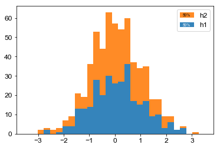
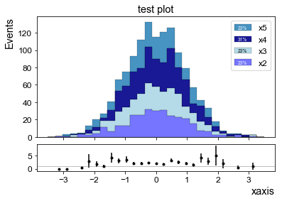
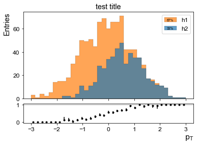
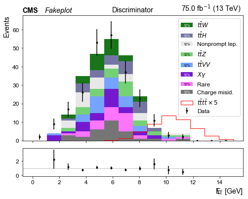
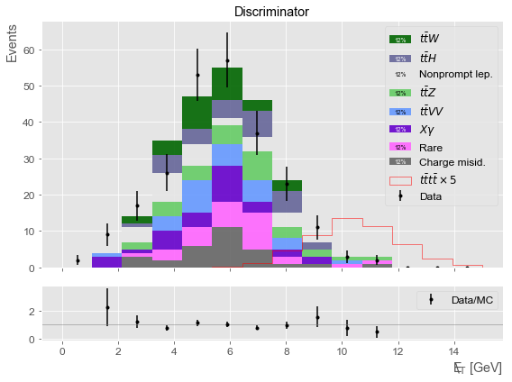
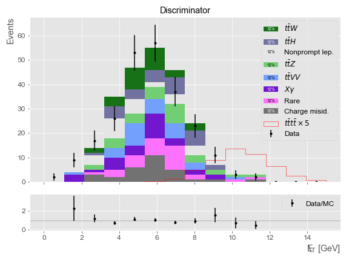

# matplottery

```python
import plotter

%matplotlib inline
# %matplotlib notebook


import numpy as np
np.random.seed(42)

from utils import Hist1D, MET_LATEX

import matplotlib as mpl

```

# Histogram objects

The `Hist1D` object wraps a numpy array or a ROOT histogram into a common histogram object, so ROOT histograms can be easily swapped with numpy array histograms. A histogram object is simply a set of bin counts, errors, and edges.

## Creation from numpy arrays
Instantiate a `Hist1D` object with a numpy array and a binning scheme. Then print it. The `__repr__` shows bin counts and errors, which are Poissonian by default. Note that other kwargs to `Hist1D` get passed to a `np.histogram()` call, so you retain the full functionality of numpy. Bin counts, edges, etc. are all stored in numpy arrays, so operations on these are optimized.


```python
h1 = Hist1D(np.random.normal(0,1,300),bins=np.linspace(-3.5,3.5,10))
print h1
```

    <Hist1D:
    [ 1.00 ± 1.00    5.00 ± 2.24   32.00 ± 5.66   69.00 ± 8.31
     95.00 ± 9.75   70.00 ± 8.37   20.00 ± 4.47    7.00 ± 2.65
      0.00 ± 0.00]
    >


## Creation from ROOT histograms
Take a histogram from ROOT and turn it into a `Hist1D`. Bin contents, edges, and errors are carried over and now you have a nice `Hist1D` object.


```python
import ROOT as r
hroot = r.TH1F("h1","h1",10,0,10)
hroot.FillRandom("gaus")
h1 = Hist1D(hroot)
print h1
```

    Welcome to JupyROOT 6.12/04
    <Hist1D:
    [3401.00 ± 58.32   1356.00 ± 36.82   227.00 ± 15.07   15.00 ± 3.87
      1.00 ± 1.00    0.00 ± 0.00    0.00 ± 0.00    0.00 ± 0.00
      0.00 ± 0.00    0.00 ± 0.00]
    >


## Math
Now that we've made these histogram objects, what can we do? Math. Errors are propagated with gaussian rules.


```python
h1 = Hist1D(np.random.normal(0,1,300),bins=np.linspace(-3.5,3.5,10))
h2 = Hist1D(np.random.normal(0,1,300),bins=np.linspace(-3.5,3.5,10))
h3 = Hist1D(np.random.normal(0,1,300),bins=np.linspace(-3.5,3.5,10))

print 0.5*(h1+h2-0.2*h2)/h3
```

    <Hist1D:
    [ 0.00 ± 0.00    0.85 ± 0.53    0.91 ± 0.27    1.23 ± 0.23
      0.87 ± 0.14    0.76 ± 0.14    0.82 ± 0.23    0.74 ± 0.41
       nan ±  nan]
    >


What about asymmetric binomial errors for efficiencies, for example?


```python
hratio = h2.divide(h3,binomial=True)
print hratio.get_errors_up()
print hratio.get_errors_down()
```

    [0.60169107 0.28556294 0.1111653  0.07192988 0.04970835 0.05531685
     0.09495624 0.21888341        nan]
    [       nan 0.11762602 0.08478546 0.06143289 0.04224986 0.04577468
     0.07376561 0.12489368        nan]


# Plotting

Now that we have these histogram objects, we can start making plots. Start off with a very simple 3 line example. First, make a couple of Hist1D objects, and use the `label` kwarg to store extra information in the object (which will become a legend label eventually).

Next, just call `plot_stack()` with a list of histograms to stack. Easy.

`plot_stack()` returns the `Figure` object and a list of `Axes` objects.


```python
h1 = Hist1D(np.random.normal(0,1,300),label="h1",bins=np.linspace(-3.5,3.5,30))
h2 = Hist1D(np.random.normal(0,1,300),label="h2",bins=np.linspace(-3.5,3.5,30))
plotter.plot_stack([h1,h2])
```


    (<matplotlib.figure.Figure at 0x104e47450>,
     [<matplotlib.axes._subplots.AxesSubplot at 0x117b0e6d0>])





### Colors and ratios
You can also attach a color to `Hist1D` objects. Any kind of matplotlib-acceptable color works, as you see from the different types below. The `plot_stack` call has more options here for labels. `mpl_hist_params` is a dictionary of kwargs that get passed to the `hist` draw call in matplotlib, so customization is straightforward (and not complicated, because options can be found in the matplotlib documentation).

Additionally, there is a `ratio` option. Using the math capabilities of the `Hist1D` objects, you can specify an arbitrary ratio to show in a panel below the main pad. This pad shows up if you specify data in the `plot_stack` call, or explicitly give a `ratio` parameter.


```python
bgs = [
    Hist1D(np.random.normal(0,1,300),label="x2",bins=np.linspace(-3.5,3.5,30),color=(0.4,0.4,1)),
    Hist1D(np.random.normal(0,1,300),label="x3",bins=np.linspace(-3.5,3.5,30),color="lightblue"),
    Hist1D(np.random.normal(0,1,400),label="x4",bins=np.linspace(-3.5,3.5,30),color="darkblue"),
    Hist1D(np.random.normal(0,1,300),label="x5",bins=np.linspace(-3.5,3.5,30),color=mpl.cm.get_cmap('Spectral')(0.9)),
    ]
plotter.plot_stack(
        bgs=bgs,
        title="test plot",
        xlabel="xaxis",
        ylabel="Events",
        mpl_hist_params={"edgecolor":"k","linewidth":0.2},
        ratio=(bgs[1]+bgs[2])/bgs[0],
        )
```


    (<matplotlib.figure.Figure at 0x117b9ac50>,
     [<matplotlib.axes._subplots.AxesSubplot at 0x117c7c1d0>,
      <matplotlib.axes._subplots.AxesSubplot at 0x117d39210>])





### More options
Here is an example of two unstacked histograms (one is a subset of the other) with an "efficiency" ratio (with asymmetric errors) below.


```python
gaus1 = np.random.normal(0,1,1000)
bins = np.linspace(-3,3,36)
gaus2 = gaus1[gaus1 > np.random.normal(0,1,1000)]
h1 = Hist1D(gaus1,bins=bins,label="h1")
h2 = Hist1D(gaus2,bins=bins,label="h2")
hratio = h2.divide(h1,binomial=True)
plotter.plot_stack(
    bgs=[h2,h1],
    title="test title",
    xlabel=r"$\mathrm{p}_\mathrm{T}$",
    ylabel="Entries",
    mpl_hist_params={"edgecolor":"k","linewidth":0.2,"stacked":False,"alpha":0.7},
    ratio=hratio
)
```


    (<matplotlib.figure.Figure at 0x117b9ad10>,
     [<matplotlib.axes._subplots.AxesSubplot at 0x117c70510>,
      <matplotlib.axes._subplots.AxesSubplot at 0x117e3eb50>])





### More bells and whistles

Here's a more "realistic" (but still fake) plot. This time, a signal histogram is included. Note the `mpl_figure_params` dictionary. These are kwargs to the `plt.figure()` call. It's used here to specify the figure size since Jupyter hijacks it and creates small figures, which would cause the legend to overlap with many things.


```python
bginfo = [
        ("Charge misid." , [0.4, 0.4, 0.4]),
        ("Rare"          , [1.0, 0.4, 1.0]),
        ("$X\\gamma$"    , [0.4, 0.0, 0.8]),
        ("$t\\bar{t}VV$" , [0.4, 0.6, 1.0]),
        ("$t\\bar{t}Z$"  , [0.4, 0.8, 0.4]),
        ("Nonprompt lep.", [0.9, 0.9, 0.9]),
        ("$t\\bar{t}H$"  , [0.4, 0.4, 0.6]),
        ("$t\\bar{t}W$"  , [0.0, 0.4, 0.0]),
        ]

bgs = []
for label, color in bginfo:
    bg = Hist1D(np.random.normal(5.8,2,30), bins=np.linspace(0,15,15), label=label, color=color)
    bgs.append(bg)

# fake data
data = Hist1D(np.random.normal(5.8,2,240), bins=bgs[0].get_edges(), color="k", label="Data")

# get sig and scale by 5
label_sig = "$t\\bar{t}t\\bar{t} \\times 5$"
sig = Hist1D(np.random.normal(10.5,1.5,500), weights=0.02*np.ones(500), bins=np.linspace(0,15,15), label=label_sig,color="r")
sig *= 5

# labels
title = "Discriminator"
xlabel = "{} [GeV]".format(MET_LATEX)
ylabel = "Events"

plotter.plot_stack(
    bgs=bgs,
    data=data,
    sigs=[sig],
    title=title,
    xlabel=xlabel,
    ylabel=ylabel,
    mpl_figure_params={"figsize":(8,6)},
    cms_type="Fakeplot",
    lumi="75.0",
)
```


    (<matplotlib.figure.Figure at 0x117b60250>,
     [<matplotlib.axes._subplots.AxesSubplot at 0x1180db810>,
      <matplotlib.axes._subplots.AxesSubplot at 0x11805d590>])





### Plot styles
Various matplotlib styles can be used. Can't guarantee that they all look pretty out of the box, but the plotter works with matplotlib's style contexts. You can also write out the figure to a file via the `filename` argument.


```python
with mpl.pyplot.style.context("ggplot"):
# with mpl.pyplot.style.context('fivethirtyeight'):
    plotter.plot_stack(
        bgs=bgs,
        data=data,
        sigs=[sig],
        title=title,
        xlabel=xlabel,
        ylabel=ylabel,
        mpl_figure_params={"figsize":(8,6)},
        filename="test.png",
    )
```





```python
from IPython.display import Image
Image(filename='test.png') 
```





